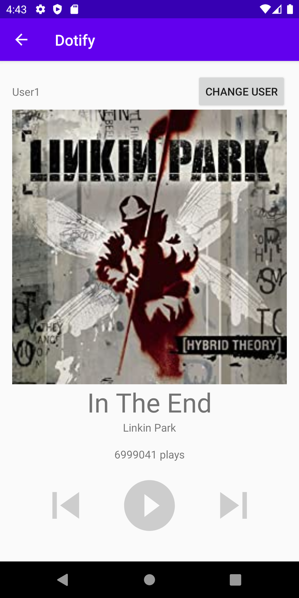

# Dotify App by Jenny Rong

This is the second version for a music app Dotify. The app is for people to listen to music. The first screen will show a list of songs, and by clicking on the song names, it will also show on the mini player. By clicking on the miniplayer, the user will be able to be redirected to the music player screen.

## Extra credit
I have completed extra credit #2, #3

## Screenshots

## Installation & Usage
click on shuffle to shuffle the songs.

click on the song in the list, the song will show on the miniplayer.

click on the miniplayer to see the music player screen.

Long clicking on the song to remove the song from the list.

click on the change user button to enter a new user name and click the apply button to switch to the new user.

click the play button and the number of playtimes will increase.

click on the skip next button to skip to the next song.

click on the skip previous button to skip to the previous song. 

Long clicking the album cover image can change the color of the texts. 
